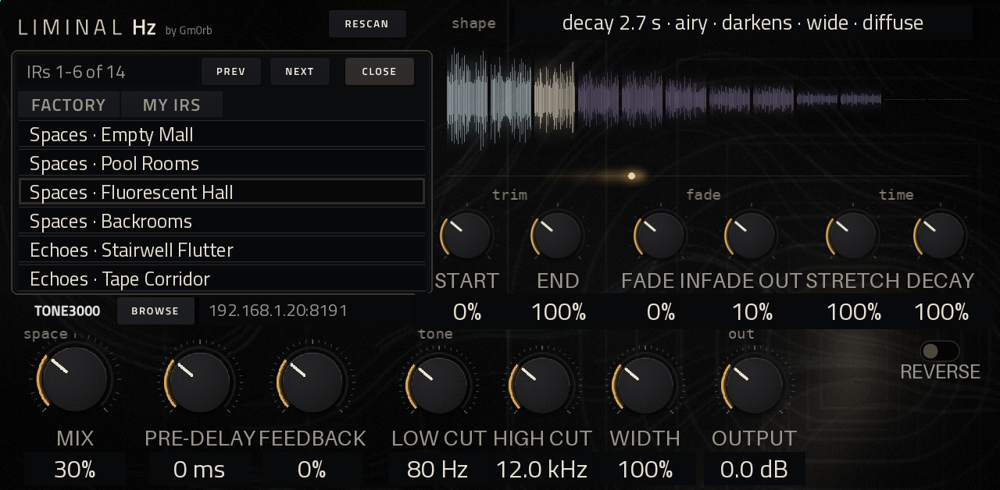
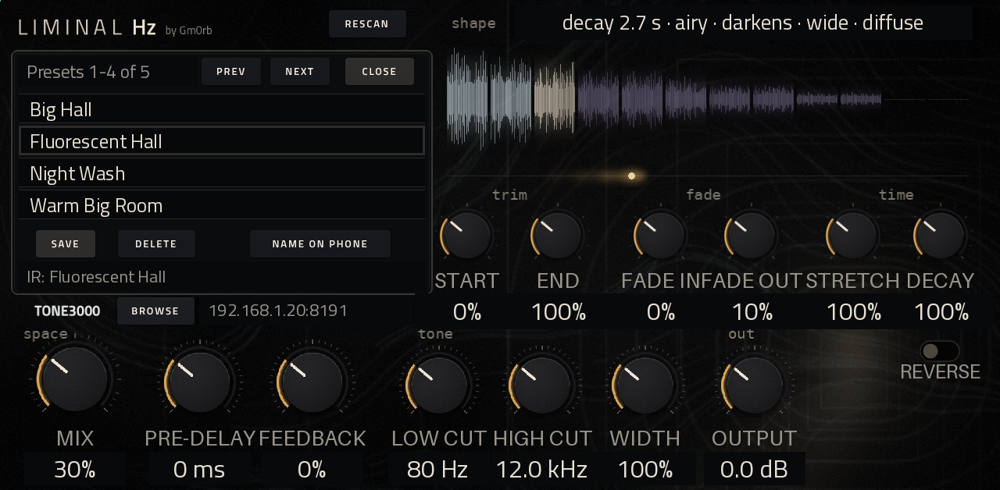
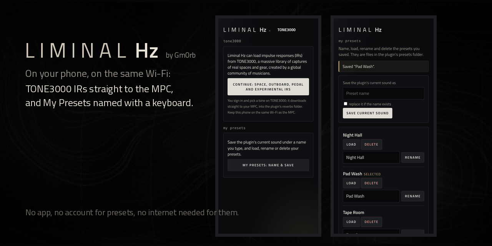

# Liminal Hz for MPC OS

*Real rooms, halls and echoes from impulse responses: the space for your NAM amp.*

A convolution reverb for **Gen 1 Akai MPC and Force**: play through impulse responses of real rooms, halls, strange
spaces and echoes, up to 5 seconds, mono or stereo. Make a room bigger or smaller with **Decay**, stretch its tail
with **Feedback**, and keep your sounds as **My Presets**. It comes with 14 factory spaces, browses your own IRs, and
downloads more from TONE3000 from your phone. A companion to [NAM A2](https://github.com/gmorb/mpc-vst-nam-a2).
Not affiliated with or endorsed by TONE3000 or Akai.

## What it looks like


One page, made for the MPC's touchscreen, with nothing hidden on other tabs:
- **Left, the browser**: the **PRESET** menu with **MY PRESETS** beside it; **FACTORY / MY IRS** with **IR LIST**
  beside it; the IR in use with **◀ ▶** to step through the list, its pack and details; **PREV PACK / NEXT PACK** and
  **DELETE** (for your own IRs: it asks twice); and the TONE3000 strip with **BROWSE** and its status line.
- **Right, the shape** of the sound, and the shaping knobs: **trim**, **fade** and **time** (Stretch, Decay, Reverse).
- **Below**, the mix controls: **space**, **tone** and **out**.

Behind it all, a doorway at the far end of an empty room.

## IR List



For long lists, so you don't have to tap ◀ ▶ over and over: tap **IR LIST** and every IR of the list you are in
(FACTORY or MY IRS, switched at the top) covers the browser, six to a page as "pack · name". Tap a row to load it (the
one in use is outlined); **PREV / NEXT** turn the pages; **CLOSE** puts the browser back. The list stays open when you
pick, so you can try one after another. Names too long for their row slide along slowly until their end shows.

## See the shape of the sound


The shape display shows what the IR sounds like, after your shaping:
- **A line in words**: how long it rings, its colour, whether it darkens or brightens, how wide it is, and whether
  it's echoes or a diffuse wash ("decay 4.8 s+ · bright · darkens · stereo · echoes").
- **A painting of the IR**: its height is the level over time; its colour is its tone (pale for airy, bone for warm,
  dusky violet for dark), so you can watch a room darken as it fades.
- **A glow** that drifts along under it after each note you play, showing where the sound is in the space. It listens
  for new notes in what you play (hits and plucks, and also pads with slow attacks played over a long release), and
  follows MIDI note-ons too whenever the MPC sends MIDI to the plugin.

## The controls


- **space**: **Mix** (the big one), **Pre-delay** (0-250 ms) and **Feedback** (0-100%). Feedback feeds the reverb back
  into itself for longer, building tails: gentle at first, about 2-4x longer around 50%, and from about 70% a long ring
  that holds at roughly the level you play at, then fades away over 30-40 s once you stop. It can't run away or jump
  in level, and each repeat comes back a little darker, like a tape echo.
- **tone**: **Low cut** and **High cut** (on the reverb only; each octave gets the same turn of the knob) and
  **Width** (0-200%). **out**: **Output**.
- **trim**: **Start** and **End**. **fade**: **Fade in** and **Fade out**.
- **time**: **Stretch** (50-200%: longer and lower, or shorter and higher), **Decay** (50-300%) and **Reverse** (the IR
  backwards: it swells into the sound).
- **Decay** changes how long the room rings without changing its pitch or its colour: each frequency band of the IR
  is measured and made to fade faster or slower, and where a band's real tail ends it is continued in kind. A small
  dark room stays a dark room, just bigger (Backrooms at 300% rings about 2.5x as long). At 100% the IR plays exactly
  as recorded. IRs are still capped at 5 s (for the MPC's CPU), so very long IRs gain less; Feedback can take the tail
  further.

Shaping happens in the background and crossfades in. Mix, Width, Output and Pre-delay glide to a new value, so moving
them never clicks.

## Factory presets

Tap **PRESET** for a menu of 14 presets in three columns, plus **Init** (no IR: your sound passes through):
- **Spaces**: Empty Mall, Pool Rooms, Fluorescent Hall, Backrooms
- **Echoes**: Stairwell Flutter, Tape Corridor, Dream Ping-Pong, Parking Slap, Intercom Echo
- **Strange**: Glass Void, Reverse Bloom, Sub Tunnel, Shimmer Fog, Liminal Hz

The factory IRs are synthetic (generated by `tools/make_factory_irs.py`, not recorded), so they're free to use like
the rest of the plugin.

## My Presets



Set the plugin the way you like it, then keep it. Tap **MY PRESETS** (beside the PRESET menu); a list opens over the
browser, four presets to a page, with **PREV / NEXT / CLOSE** as in the IR List:
- **SAVE** keeps the current sound: all the knobs and the IR in use (factory or one of yours). It is named after its
  IR ("Fluorescent Hall", "Fluorescent Hall 2"...) and selected.
- Tap a row to load that preset (settings and IR; if its IR has moved it is found again, and if it is gone the
  settings still apply and the line says so). The one in use is outlined, the PRESET field shows "My: <name>", and a
  project remembers which one.
- **DELETE** removes the selected preset: it asks twice, like the IR browser, and deletes the file permanently.
- **NAME ON PHONE**: the MPC's screen has no keyboard, so names are typed on your phone (see below).
- Each preset is a small text file in the plugin's `presets/` folder (`<name>.lhzp`), kept across upgrades. You can
  also rename or delete the files from a computer; press **RESCAN** and the list follows.

## Your phone: TONE3000 and preset names



The plugin serves two small pages to a phone (or computer) on the same Wi-Fi as the MPC, in the plugin's own look.
No app to install, and no password (each closes by itself after 15 idle minutes).
- Tap **BROWSE** and the TONE3000 strip shows an address such as `192.168.1.20:8191`: open it on your phone. Sign in
  to TONE3000 and pick a tone from the **Space, Outboard, Pedal or Experimental** categories; only IRs are offered,
  and only `.wav` IRs are ever downloaded. The tone downloads straight to the MPC, into the plugin's
  `reverbs/TONE3000/<tone>/` folder, and is selected when it's done.
- The same page has a **My Presets: name & save** button: type a name and **Save current sound**, or **Load**,
  **Rename** and **Delete** any preset. **NAME ON PHONE** in the My Presets list opens this page directly (the
  address then ends in `/presets`). The presets page needs no internet.

## Your own IRs

Put `.wav` IRs (mono or stereo, any sample rate) in any folder named `reverbs` on the MPC's drives and cards, in
packs (subfolders) if you like; switch to **MY IRS**. The plugin remembers where it found them, so starting up and
**RESCAN** are quick even on a full card.

## Install

Download `Liminal-Hz-for-MPC-OS-<version>.zip` from the releases and follow its README: copy the
`Gm0rb - VST - Liminal Hz` folder into your `Synths` folder and run `vstscanner`; Liminal Hz then appears under
**Gm0rb** in MPC's plugin list. Or install it from the MPC OS Plugin Catalog. After updating, re-insert the plugin on
your tracks. Your `reverbs` and `presets` folders are kept across upgrades.

## How long IRs stay cheap
A 5-second stereo IR is 220,500 taps per channel: convolved in MPC's 128-sample blocks (the usual zero-latency
method, as NAM A2's cab IRs) it would cost far more than a whole audio block on the RK3288. Liminal Hz splits it:
- **head** (the first 4096 samples, 93 ms): 128-sample blocks on the audio thread, zero latency, the same cost every
  block;
- **tail** (the rest): 2048-sample blocks on a second thread, on another core. Output block m of the tail depends on
  input up to block m-2, so each block is computed a whole block (46 ms) ahead of its deadline.

Measured on an Akai Force (RK3288), real time, % of one 2.9 ms audio block:

| 5 s stereo IR | audio thread mean / max | second thread | late blocks |
|---|---|---|---|
| all on the audio thread, 128-sample blocks | too heavy to run | | |
| tail on the audio thread, 2048-sample blocks | 11% / 137% | | 0 |
| **tail on a second thread** (Liminal Hz) | **3.4% / 7.2%** | 8.3% of a core | **0** |

Every method equals direct convolution to float precision (`tools/bench_reverb.cpp --check`, PC and ARM). Decay,
Feedback's analysis and the playhead's note detection add little on top: the first two run when an IR is prepared,
off the audio thread.

## Build and test
```
git clone https://github.com/sd88me/mpc-vst-plugins ../mpc-vst-plugins
git -C ../mpc-vst-plugins checkout 3e50b052268d81e6c61a17a1390ced62f0fdff74   # as in .github/workflows/build.yml
pip install ziglang==0.16.0 pillow playwright && python3 -m playwright install --with-deps chromium
sudo apt install qemu-user libc6-armhf-cross libcurl4-openssl-dev
vst/build.sh             # the device plugin (armhf) and its page
vst/build.sh host        # the same plugin for this PC
tools/test.sh            # convolution vs direct, engine, TONE3000 sign-in, library, My Presets, plugin (with a TONE3000 mock)
SANITIZE=asan tools/test.sh ; SANITIZE=tsan tools/test.sh ; ARM=1 tools/test.sh
REPO=<you>/mpc-vst-liminal-hz tools/package.sh
```
The device benchmark: `tools/bench_reverb.cpp` (see its header). The README images: `tools/make_banners.py` (see its
header). What changed in each version: [CHANGELOG.md](CHANGELOG.md).

## Thanks
To [Amit Talwar](https://github.com/intelliriffer), whose suggestion started the work that made the IR search at start-up and RESCAN fast.

## Support

[](https://www.buymeacoffee.com/Gmorb)

## Licence
MIT ([LICENSE](LICENSE)); components and their licences: [NOTICE.md](NOTICE.md).
