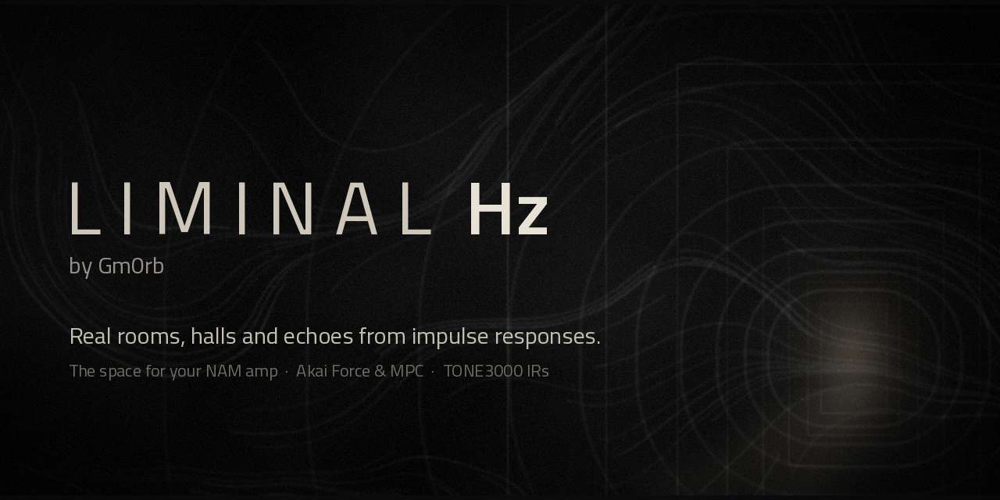
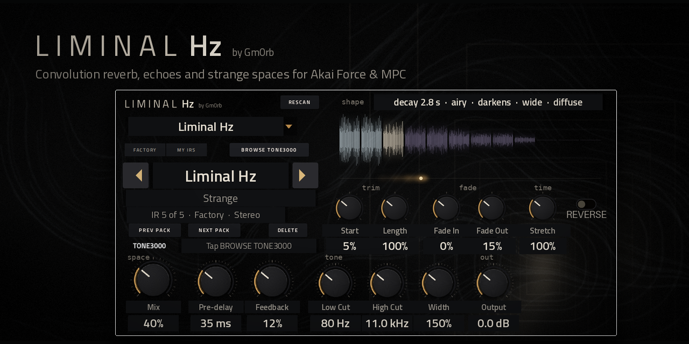
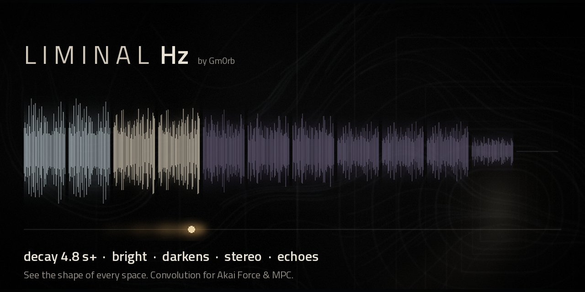
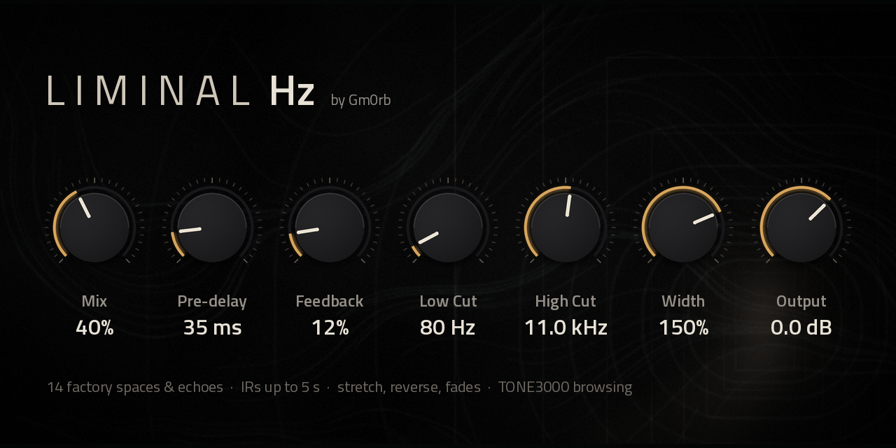

# Liminal Hz for MPC OS

*Real rooms, halls and echoes from impulse responses: the space for your NAM amp.*

A convolution reverb for **Gen 1 Akai MPC and Force**: play through impulse responses of real rooms, halls, strange
spaces and echoes, up to 5 seconds, mono or stereo. It comes with 14 factory spaces, browses your own IRs, and
downloads more from TONE3000 from your phone. A companion to [NAM A2](https://github.com/gmorb/mpc-vst-nam-a2).
Not affiliated with or endorsed by TONE3000 or Akai.

## What it looks like



One page, made for the MPC's touchscreen. On the left, the browser: a **PRESET** menu, **FACTORY / MY IRS**, the IR
with ◀ ▶ and pack buttons, and **BROWSE TONE3000**. On the right, the **shape** of the sound. Below, the controls,
grouped by what they do. Behind it all, a doorway at the far end of an empty room.

## See the shape of the sound



The shape display shows what the IR sounds like, after your shaping:
- **A line in words**: how long it rings, its colour, whether it darkens or brightens, how wide it is, and whether
  it's echoes or a diffuse wash ("decay 4.8 s+ · bright · darkens · stereo · echoes").
- **A painting of the IR**: its height is the level over time; its colour is its tone (pale for airy, bone for warm,
  dusky violet for dark), so you can watch a room darken as it fades.
- **A glow** that drifts along under it after each note you play, showing where the sound is in the space.

## The controls



- **space**: **Mix** (the big one), **Pre-delay** (0-250 ms) and **Feedback** (0-90%, for longer, building echoes;
  soft-limited so it never runs away).
- **tone**: **Low cut** and **High cut** (on the reverb only) and **Width** (0-200%). **out**: **Output**.
- **trim**: **Start** and **Length**. **fade**: **Fade in** and **Fade out**. **time**: **Stretch** (50-200%:
  longer and lower, or shorter and higher) and **Reverse** (the IR backwards: it swells into the sound).
  Shaping happens in the background and crossfades in.

## Factory presets

Tap **PRESET** for a menu of 14 presets in three columns, plus **Init** (no IR: your sound passes through):
- **Spaces**: Empty Mall, Pool Rooms, Fluorescent Hall, Backrooms
- **Echoes**: Stairwell Flutter, Tape Corridor, Dream Ping-Pong, Parking Slap, Intercom Echo
- **Strange**: Glass Void, Reverse Bloom, Sub Tunnel, Shimmer Fog, Liminal Hz

The factory IRs are synthetic (generated by `tools/make_factory_irs.py`, not recorded), so they're free to use like
the rest of the plugin.

## Install

Download `Liminal-Hz-for-MPC-OS-<version>.zip` from the releases and follow its README: copy the
`Gm0rb - VST - Liminal Hz` folder into your `Synths` folder and run `vstscanner`; Liminal Hz then appears under
**Gm0rb** in MPC's plugin list. Put your own IRs in any folder named `reverbs`. Or install it from the MPC OS Plugin
Catalog.

## How long IRs stay cheap
A 5-second stereo IR is 220,500 taps per channel: convolved in MPC's 128-sample blocks (the usual zero-latency
method, as NAM A2's cab IRs) it would cost far more than a whole audio block on the RK3288. Liminal Hz splits it:
- **head** (the first 4096 samples, 93 ms): 128-sample blocks on the audio thread, zero latency, the same cost every
  block;
- **tail** (the rest): 2048-sample blocks on a second thread, on another core. Output block m of the tail depends on
  input up to block m-2, so each block is computed a whole block (46 ms) ahead of its deadline.

Measured on an Akai Force (RK3288), real time, % of one 2.9 ms audio block:

| 5 s stereo IR | audio thread mean / max | second thread | late blocks |
|---|---|---|---|
| all on the audio thread, 128-sample blocks | too heavy to run | | |
| tail on the audio thread, 2048-sample blocks | 11% / 137% | | 0 |
| **tail on a second thread** (Liminal Hz) | **3.4% / 7.2%** | 8.3% of a core | **0** |

Every method equals direct convolution to float precision (`tools/bench_reverb.cpp --check`, PC and ARM).

## Build and test
```
git clone https://github.com/sd88me/mpc-vst-plugins ../mpc-vst-plugins
git -C ../mpc-vst-plugins checkout 081c247310560cc94bcdb0dd4db3a40e395cbe96
pip install ziglang==0.16.0 pillow playwright && python3 -m playwright install --with-deps chromium
sudo apt install qemu-user libc6-armhf-cross libcurl4-openssl-dev
vst/build.sh             # the device plugin (armhf) and its page
vst/build.sh host        # the same plugin for this PC
tools/test.sh            # convolution vs direct, engine, TONE3000 sign-in, library, plugin (with a TONE3000 mock)
SANITIZE=asan tools/test.sh ; SANITIZE=tsan tools/test.sh ; ARM=1 tools/test.sh
REPO=<you>/mpc-vst-liminal-hz tools/package.sh
```
The device benchmark: `tools/bench_reverb.cpp` (see its header).

## Licence
MIT ([LICENSE](LICENSE)); components and their licences: [NOTICE.md](NOTICE.md).
